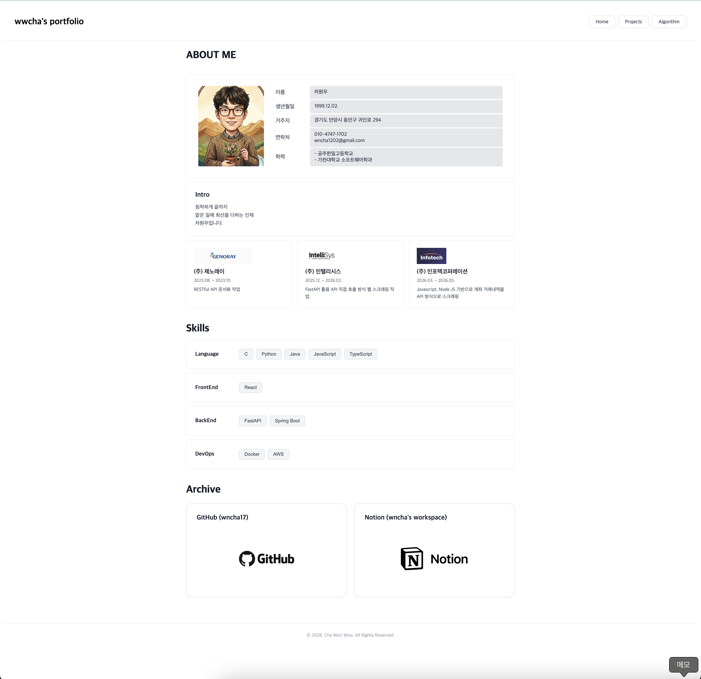
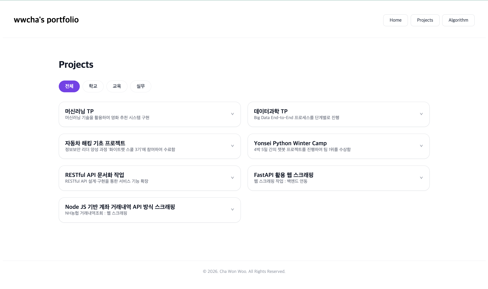
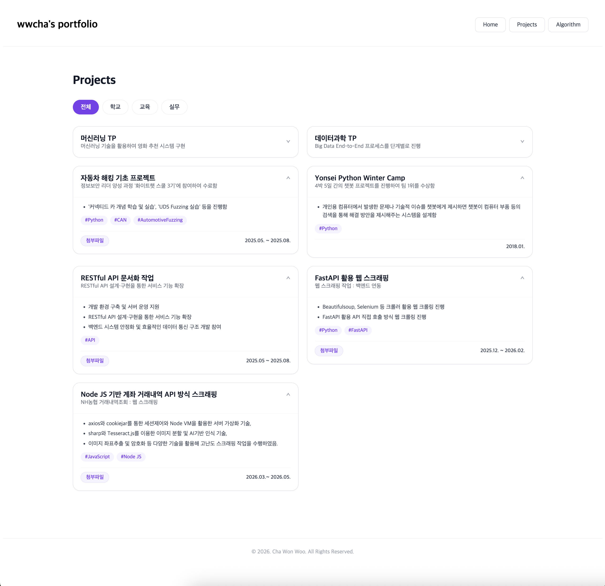
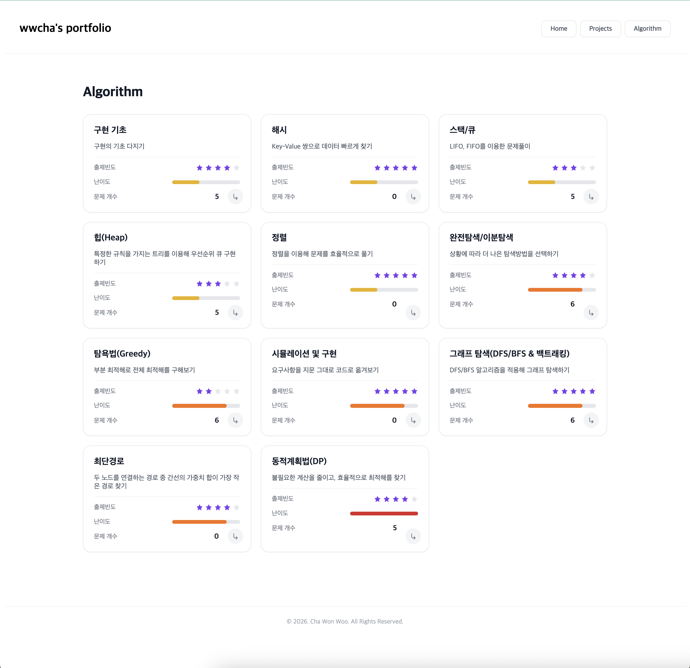
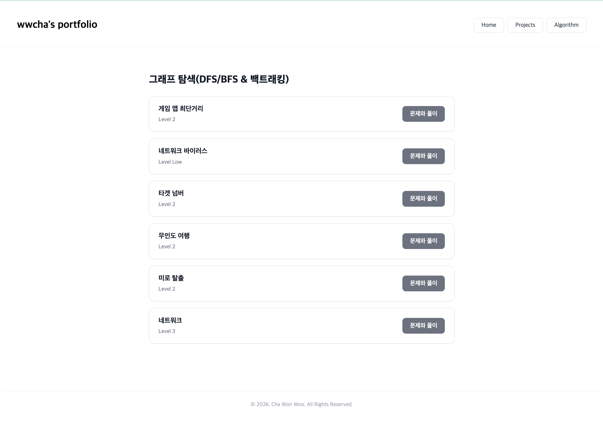

# wwcha's portfolio

React + Supabase로 만든 개인 포트폴리오입니다. 프로젝트, 알고리즘 문제 풀이 기록까지 한 곳에서 관리합니다.

🔗 **배포 링크**: [https://wwcha-portfolio.vercel.app](https://wwcha-portfolio.vercel.app)

---

## 📸 Preview

<table>
  <tr>
    <td width="33%" align="center">
      <br>
      <sub><b>HomePage</b></sub>
    </td>
    <td width="33%" align="center">
      <br>
      <sub><b>ProjectsPage</b></sub>
    </td>
    <td width="33%" align="center">
      <br>
      <sub><b>ProjectsPage 2</b></sub>
    </td>
  </tr>
  <tr>
    <td width="33%" align="center">
      <br>
      <sub><b>AlgorithmPage</b></sub>
    </td>
    <td width="33%" align="center">
      <br>
      <sub><b>ProblemsPage</b></sub>
    </td>
    <td width="33%"></td>
  </tr>
</table>

---

## ✨ 주요 기능

- **Skills**: 각 스킬 칩에 마우스를 올리면 관련 툴팁 표시
- **Archive**: GitHub / Notion 카드를 클릭하면 각 저장소로 바로 이동
- **Projects**: 카드를 클릭하면 상세 설명, 사용 기술, 첨부파일, 진행 기간을 펼쳐서 확인
- **Algorithm**: 분류 카드의 화살표를 누르면 해당 분류로 필터링된 Problems 페이지로 이동

---

## 🛠 기술 스택


`React` · `TypeScript` · `Vite` · `react-router-dom` · `TanStack Query` · `Supabase` · `CSS Modules`

---

## 🧭 문제 해결 & 배운 점

| 문제 | 원인 | 해결 |
|---|---|---|
| `.env` 파일 미반영 | `.env`는 `.gitignore`에 포함되어 git에 올라가지 않음 → 새 환경에서 클론하면 Supabase 클라이언트 초기화 실패 | `.env`를 로컬에 새로 생성하고, Vite는 서버 시작 시점에만 `.env`를 읽는다는 점을 인지해 재시작 습관화 |
| 함수명 불일치 | `getProjects.ts`를 복사해 `getAlgorithm.ts`를 만들면서 내부 함수명(`getProjects`)을 안 바꿈 | import하는 이름과 export하는 이름을 항상 짝지어 확인, 파일명·함수명 통일 규칙 적용 |
| FSD(Feature-Sliced Design) 마이그레이션 | 초기엔 페이지 단위로 코드가 뭉쳐 있어 재사용/유지보수가 어려움 | `entities`(도메인 단위) → `widgets`(UI 블록) → `pages`(조립) 순으로 단계적으로 리팩터링, 각 레이어는 자신보다 아래 레이어만 참조하도록 정리 |

더 자세한 트러블슈팅 과정은 [`docs/ARCHITECTURE.md`](./docs/ARCHITECTURE.md)에서 확인할 수 있습니다.

---

## 📁 폴더 구조

이 프로젝트는 **Feature-Sliced Design(FSD)** 구조를 따릅니다.

```
src
├── app                     # 앱 진입점, 라우팅 설정
├── pages                   # 라우트 단위 페이지 (widgets를 조립)
│   ├── HomePage
│   ├── ProjectPage
│   ├── AlgorithmPage
│   └── ProblemsPage
├── widgets                 # 여러 entity를 조합한 UI 블록
│   ├── header
│   ├── footer
│   ├── about-list
│   ├── skills-list
│   ├── archive-list
│   ├── project-list
│   ├── algorithm-list
│   └── problems-list
├── entities                # 업무 도메인 단위 (model + api)
│   ├── idCard
│   ├── introCard
│   ├── expCard
│   ├── skillsList
│   ├── archiving
│   ├── projectList
│   ├── algorithm
│   └── problem
└── shared                  # 공용 코드 (supabase 클라이언트 등)
```

레이어별 역할과 각 파일의 상세 설명은 👉 [`docs/ARCHITECTURE.md`](./docs/ARCHITECTURE.md) 참고

---

## ⚙️ 설치 및 실행 방법

```bash
# 1. 저장소 클론
git clone https://github.com/wwcha/wwcha-portfolio.git
cd wwcha-portfolio

# 2. 패키지 설치
npm install

# 3. 프로젝트 루트에 .env 파일 생성
```

`.env`
```
VITE_SUPABASE_URL=your-supabase-project-url
VITE_SUPABASE_ANON_KEY=your-supabase-anon-key
```

```bash
# 4. 개발 서버 실행
npm run dev
```